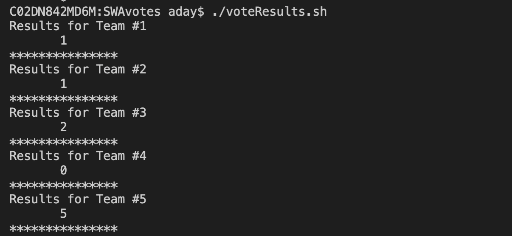
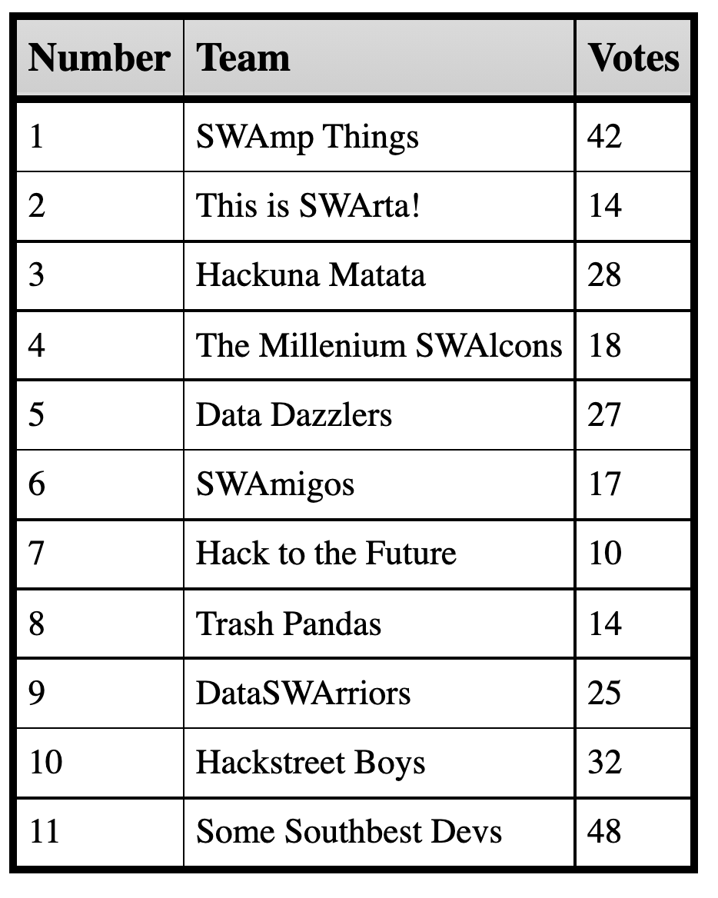
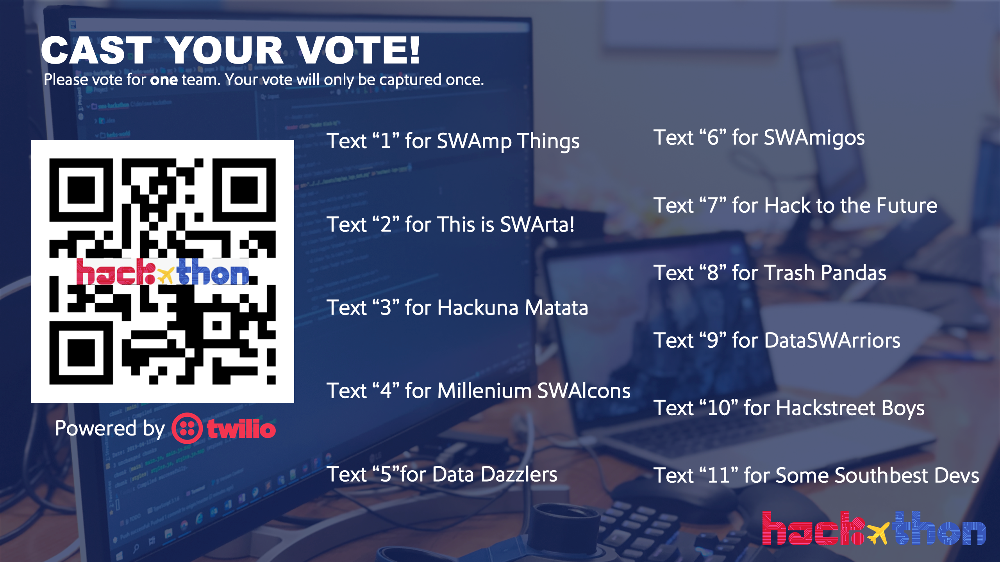

# SWAvotes

An SMS-based voting system for team competitions. Participants text a team number to a Twilio phone number; the app tallies votes in real time and serves results as an HTML leaderboard. Each sender's most recent text counts as their vote.

## How it works

1. Participants send an SMS with their team number (1–11) to the designated Twilio number
2. On request, the app fetches all messages from Twilio, deduplicates by sender, and tallies votes
3. Results are returned as an HTML table — either printed to the console (local) or served via AWS API Gateway (cloud)

## Architecture

```
SMS → Twilio → AWS API Gateway → Lambda (app.js → lib/swavotes.js) → HTML response
```

- **Local mode**: `Votes.js` fetches messages → `vote.txt` → `voteResults.sh` tallies and prints
- **Cloud mode**: Lambda handler fetches live from Twilio on each request; API Gateway caches for 5 seconds

## Dependencies

| Dependency | Purpose |
| --- | --- |
| [Twilio](https://www.twilio.com) | SMS reception and message history API |
| [AWS Lambda](https://aws.amazon.com/lambda/) | Serverless compute (Node.js 22.x) |
| [AWS API Gateway](https://aws.amazon.com/api-gateway/) | HTTP endpoint (`GET /swa/votes`) |
| [Serverless Framework](https://www.serverless.com) | Infrastructure-as-code deployment to AWS |

## Prerequisites

- Node.js >= 22
- A [Twilio account](https://www.twilio.com) with an SMS-capable phone number
- AWS credentials configured (`~/.aws/credentials` or environment variables) for cloud deployment
- [Serverless Framework](https://www.serverless.com/framework/docs/getting-started) for cloud deployment

## Environment Variables

Copy `.env.example` to `.env` and fill in your Twilio credentials:

```bash
cp .env.example .env
```

| Variable | Description |
| --- | --- |
| `TWILIO_ACCOUNT_SID` | Your Twilio Account SID |
| `TWILIO_API_KEY` | Twilio API Key |
| `TWILIO_API_SECRET` | Twilio API Secret |
| `TWILIO_VOTER_NUMBER` | The Twilio number that receives votes (e.g. `+15550001234`) |

## Installation

```bash
git clone https://github.com/aricday/SWAvotes.git
cd SWAvotes
npm install
```

## Running locally

```bash
source .env
./voteResults.sh
```

This fetches all messages from Twilio, writes them to `vote.txt`, deduplicates voters, and prints a per-team tally to the console.



## Deploying to AWS

```bash
npm install -g serverless
serverless deploy -s dev
```

The endpoint will be available at:
```
GET https://<api-id>.execute-api.us-east-1.amazonaws.com/dev/swa/votes
```



## Testing

```bash
npm test
```

The test suite uses Jest with mocked Twilio and filesystem dependencies — no credentials required to run tests. Tests cover vote tallying logic, HTML generation, and the Lambda handler.

## Team configuration

Team names are defined in [teams.yml](teams.yml). Edit that file to update team names without touching application code.

## Call to Action


