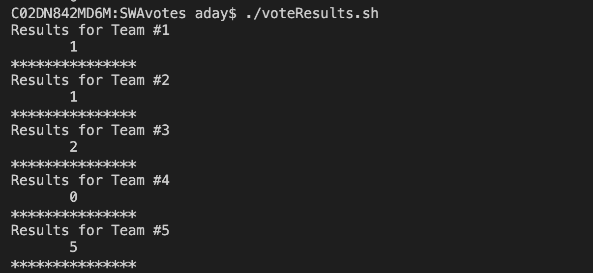

# SWAvotes
Voter repo for sms survey

## Run Locally
1. Clone repo and collect .env variables

2. Install dependencies
```
$ npm install fs twilio

$ cp .env.example .env

$ source .env
```

3. Execute VoteResults.sh
```
$ ./voteResults.sh
```
## Results Local Script


## Run in AWS
```
$ npm install serverless

$ serverless deploy -s dev

```

## Browse the Results Page


## Call to Action - Vote By Text!


